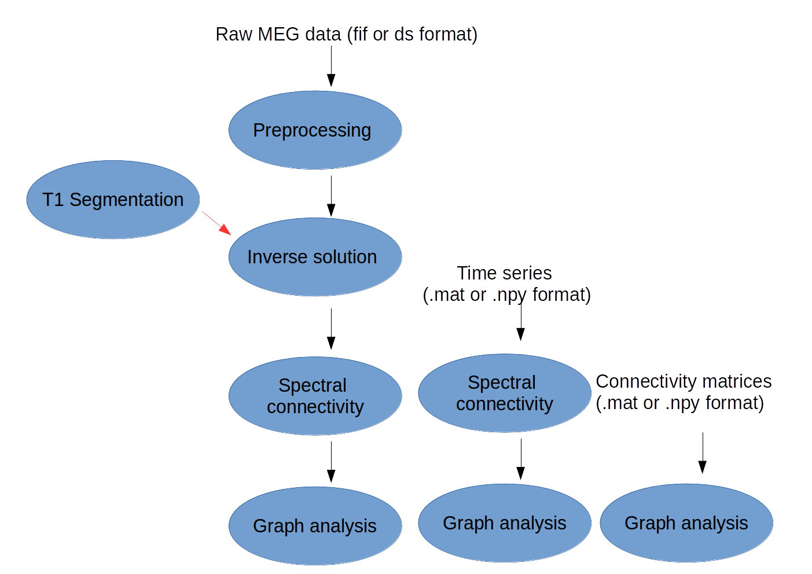

.. ephypype documentation master file, created by
   sphinx-quickstart on Wed Feb 22 13:05:03 2017.
   You can adapt this file completely to your liking, but it should at least
   contain the root `toctree` directive.

Neuropycon documentation
************************
    
Neuropycon is an open-source multi-modal brain data analysis kit which provides **Python-based 
pipelines** for advanced multi-thread processing of fMRI, MEG and EEG data, with a focus on connectivity 
and graph analyses. Neuropycon is based on `Nipype <http://nipype.readthedocs.io/en/latest/#>`_,
a tool developed in fMRI field, which facilitates data analyses by wrapping many commonly-used neuro-imaging software into a common
python framework.

Neuropycon project includes three different packages:

* :ref:`ephypype` based on |MNE python| includes pipelines for electrophysiology analysis
* |neuropycon_cli| is a command line interface for ephypype package
* |graphpype| based on |radatools| includes pipelines for graph theoretical analysis of neuroimaging data

.. |MNE python| raw:: html

   <a href="http://martinos.org/mne/stable/index.html" target="_blank">MNE python</a>

.. |radatools| raw:: html

   <a href="http://deim.urv.cat/~sergio.gomez/radatools.php" target="_blank">radatools</a>

.. |graphpype| raw:: html

   <a href="http://davidmeunier79.github.io/graphpype" target="_blank">graphpype</a>
   
.. |neuropycon_cli| raw:: html

   <a href="https://github.com/dmalt/neuropycon_cli" target="_blank">neuropycon_cli</a>
 
Neuropycon provides a very common and fast framework to develop workflows for advanced analyses, in particular
defines a set of different **pipelines** that can be used stand-alone or as **lego** of a bigger workflow:
the input of a pipeline will be the output of another pipeline. 

For each possible workflow the **input data** can be specified in three different ways: 

* raw MEG data in **.fif** and **.ds** format 
* time series of connectivity matrices in **.mat** (Matlab) or **.npy** (Numpy) format
* connectivity matrices in **.mat** (Matlab) or **.npy** (Numpy) format

.. _lego:

   Main inputs and subsequent pipeline steps

Each pipeline based on nipype engine is defined by **nodes** connected together, 
where each node maybe wrapping of existing software (as MNE-python modules or radatools functions) 
as well as providing easy ways to implement function defined by the user. 

.. _installation:

Installation
============

Install ephypype
----------------

.. code-block:: bash

    git clone https://github.com/neuropycon/ephypype.git
    cd ephypype
    python setup.py develop
    cd ..

see :ref:`includeme_ephypype` for more information

Install clipype
---------------

.. code-block:: bash

    git clone https://github.com/dmalt/neuropype_cli.git
    cd neuropycon_cli
    pip install .
    cd ..
    
see |README_cli| for more information.

.. |README_cli| raw:: html

   <a href="https://github.com/dmalt/neuropycon_cli/blob/master/README.md" target="_blank">README</a>

Install graphpype
-----------------

.. code-block:: bash

    git clone https://github.com/neuropycon/graphpype.git
    cd graphpype
    python setup.py develop
    cd ..

see see :ref:`includeme_graphpype` for more information.

.. |README_graph| raw:: html

   <a href="http://davidmeunier79.github.io/graphpype/includeme.html" target="_blank">README</a>

Packages
========

.. toctree::
   :maxdepth: 2

   ephypype/ephypype
   neuropycon_cli <https://github.com/dmalt/neuropycon_cli>
   graphpype/index

Examples
========

.. toctree::
   :maxdepth: 3
     
   examples/examples 

CINQ
====

.. toctree::
   :maxdepth: 1
   
   cinq/cinq 
   
Indices and tables
==================

* :ref:`genindex`
* :ref:`modindex`
* :ref:`search`

